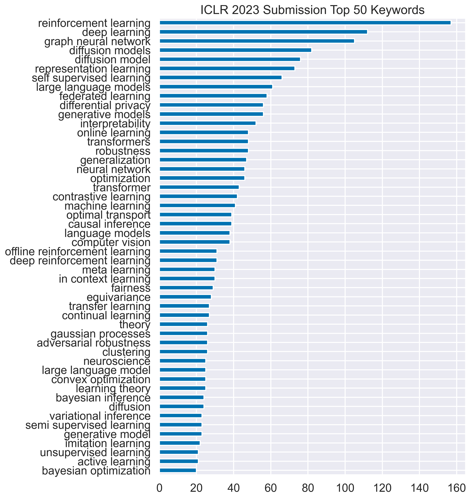
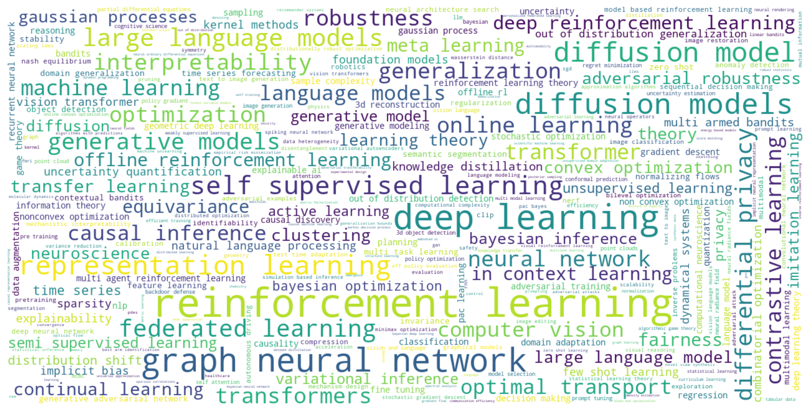

# Crawl and Visualize NeurIPS 2023 OpenReview Data
This data includes all accepted papers and the rejected papers that opted in for public release from NeurIPS 2023.

## Descriptions

This Jupyter Notebook contains the data crawled from Neurips 2023 OpenReview webpages and their visualizations. The list of submissions (sorted by the average ratings) can be found here.

## Crawl Data
1. Run `neurips-crawler.js` to crawl the list of papers.

## Visualization

**Keywords Frequency**

The top 50 common keywords (uncased) and their frequency:

    

**Keywords Cloud**

The word clouds formed by keywords of submissions show the hot topics including *deep learning*, *reinforcement learning*, *representation learning*, *graph neural network*, etc.

    

